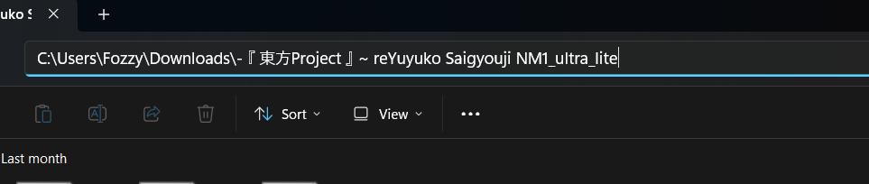

# osu! insta-fade skin generator

A very barebone, terrible, and badly coded insta-fade skin generator

## Disclaimer

This app was made for educational purposes (and a bit of fun). **I am not responsible for any damages caused by this app so use it at your own risk**. Always make sure to back up your stuff before running sussy apps like this one.

## Usage (Windows)

### osu!stable

0. Locate the osu! skin folder path you want to make adjustment to. It should be in `Skins\<Skin Name>` folder in your osu! installation directory (default is `C:\Users\<Username>\AppData\Local\osu!`). Another way to find it is to open the skin in osu! and select `Open current skin folder` in the skin options. It should open the skin folder in your file explorer.

1. Enter the osu! skin path into the app. You can do this by copying the path from the address bar in your file explorer and pasting it into the app's text box, then pressing Enter. Another option is to use the `Browse` button and point it to the skin folder. If you do it correctly, it shouldn't show any error in the log box and the first combo colour should be read and shown in the app. 

2. Adjust the settings as you like. Hover over each setting to see the tooltip for more information about what it does.

3. When satisfied with the settings, click the `Generate` button. It should generate the insta-fade skin and save it in the same folder as the original skin.


**For example**, the skin I want to convert is `C:\Users\Fozzy\Downloads\- 『 東方Project 』 ~ reYuyuko Saigyouji NM1_ultra_lite` as seen in the screenshot below (you might need to left-click your mouse into the white spaces in the address bar on the right for the full path to show up).



Select all of it, copy and paste it into the app's text box as shown, then press Enter.


If you do it correctly, it shouldn't show any error in the log text box at the bottom, and the first combo colour should be read and shown in the app.

### osu!lazer

osu!lazer is a bit trickier since you have to export the skin to edit it. You can do that by going to `Skin layout editor > File > Edit externally`. Osu! should then mount the skin to a temp folder and open it in your file explorer. You can then follow the same steps as osu!stable, and when you're done, go back to osu!lazer and select `Finish editing and importing changes` to import the skin back to the game.

I'd personally recommend unzipping the skin by changing the file extension from `.osk` to `.zip`, extracting it, and then using the app to edit the extracted folder. After that, you can just zip it back up and change the file extension back to `.osk` before importing it back to osu!lazer.

## Installation

Download the latest release from the [Releases](https://github.com/Fozzyishere/osu-insta-fade-skin-generator/releases/) page. Pick the correct version for your operating system (Windows or Linux, x64 or ARM64) and just run the executable. No installation required.

## Contributing

I desperately need this, lol. Just follow the [GitHub Standard Fork & Pull Request Workflow](https://gist.github.com/Chaser324/ce0505fbed06b947d962), and we should be good.

### Building and testing

```bash
dotnet build -c Debug
dotnet test OsuInstaFadeSkinGenerator.Tests -c Debug
```

Build settings in [Directory.Build.props](Directory.Build.props) enable `TreatWarningsAsErrors` + `EnforceCodeStyleInBuild`, so the build is strict; please keep it warning-free.
