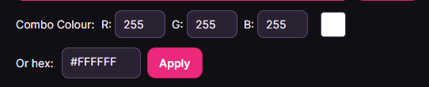

# osu! insta-fade skin generator

A very barebones, terrible, and badly coded insta-fade skin generator

## Disclaimer

This app is made for educational purposes (and a bit of fun) and is not intended to be used by people who don't know how to use it. **I am not responsible for any damages caused by this app so use it at your own risk**. Always make sure to back up your stuff before running sussy apps like this one.

## Usage (Windows for now, since I don't play osu! on Linux)

### osu!stable

**Note:** If you know what you're doing just use the `Browse` button to make things quicker.

1. Locate your skin folder. You can either find it through osu! by pressing the `Open current skin folder` button with the skin you want to convert, or do it manually by finding the osu! installation directory (should be in `C:\Users\<Username>\AppData\Local\osu!` by default).

2. Copy the path from the address bar and paste it into the text box.

3. Make adjustments to the output using the selected options. You can change the combo colour (one colour, though — I reckon you aren't that insane to use RGB combo colours with a white insta-fade skin), back up some parts of your skin elements in case you want to roll back, process @2x elements, or even create a triplestacked skin. Tooltip should give you enough information on what each option does. If not, just YOLO it :ujel:

**For example**, the skin I want to convert is `D:\Games\osu-stable\Skins\Rafis HDDT 2024` as seen in the screenshot below (you might need to left-click your mouse into the white spaces in the address bar on the right for the full path to show up).

Select all of it, copy and paste it into the app's text box as shown, then press Enter.

If you do it correctly, it shouldn't show any error, and the first combo colour should be read and shown in the app.

### osu!lazer (might be outdated in the future since they update their UI like once per week :ujel:)

osu!lazer is a bit trickier since you have to export the skin to edit it. You can do that by going to `Skin layout editor > File > Edit externally`. Osu! should then mount the skin to a temp folder and open it in your file explorer. You can then follow the same steps as osu!stable, and when you're done, go back to osu!lazer and select `Finish editing and importing changes` to import the skin back to the game.

I'd personally recommend unzipping the skin by changing the file extension from `.osk` to `.zip`, extracting it, and then using the app to edit the extracted folder. After that, you can just zip it back up and change the file extension back to `.osk` before importing it back to osu!lazer.

## Installation

Download the latest release from the [Releases](https://github.com/Fozzyishere/osu-insta-fade-skin-generator/releases/) page. Pick the correct version for your operating system (Windows or Linux, x64 or ARM64) and just run the executable. No installation required.

## Contributing

I desperately need this, lol. Just follow the [GitHub Standard Fork & Pull Request Workflow](https://gist.github.com/Chaser324/ce0505fbed06b947d962), and we should be good.
